# 5. Diagrama Entidad-Relación (DER)

Diagrama generado a partir del esquema físico real (`sql/01_schema.sql`). Incluye las **30 tablas**, sus claves primarias (`PK`), foráneas (`FK`), columnas únicas (`UK`) y las 30 relaciones con su cardinalidad. GitHub lo renderiza automáticamente.

## Cómo leer las cardinalidades (notación pata de gallo)

| Símbolo | Significado |
|---|---|
| `\|\|--o{` | Uno (obligatorio) a cero o muchos. Ej.: una consulta tiene 0..N mediciones de PIO; cada PIO pertenece a exactamente una consulta. |
| `\|\|--o\|` | Uno a cero o uno (1:1). Ej.: un paciente tiene 0..1 historia clínica; cada historia es de un único paciente (`UNIQUE patient_id`). |
| `\|o--o{` | Cero o uno a muchos: la FK admite NULL. Ej.: `patients.city_id` es opcional. |

Las relaciones N:M se resuelven con **entidades asociativas**:

- `medical_visits` N:M `diagnoses` → `visit_diagnoses` (PK compuesta `visit_id, diagnosis_id`).
- `patients` N:M `allergens` → `patient_allergies` (PK compuesta `patient_id, allergen_id`).

La etiqueta de cada relación es la columna FK que la implementa. `audit_logs` no tiene relaciones físicas a propósito: guarda `table_name` + `record_id` para conservar el rastro aunque el registro original se elimine.

## Diagrama

```mermaid
erDiagram
    patients ||--o{ clinical_alerts : "patient_id"
    clinical_histories ||--o{ clinical_documents : "clinical_history_id"
    patients ||--o| clinical_histories : "patient_id"
    glaucoma_records ||--o{ glaucoma_controls : "glaucoma_record_id"
    medical_visits ||--o| glaucoma_controls : "visit_id"
    patients ||--o| glaucoma_records : "patient_id"
    glaucoma_types ||--o{ glaucoma_records : "glaucoma_type_id"
    medical_visits ||--o{ gonioscopy_exams : "visit_id"
    specialties ||--o{ healthcare_professionals : "specialty_id"
    medical_visits ||--o{ intraocular_pressures : "visit_id"
    clinical_histories ||--o{ medical_visits : "clinical_history_id"
    healthcare_professionals ||--o{ medical_visits : "professional_id"
    medical_visits ||--o{ oct_exams : "visit_id"
    medical_visits ||--o{ ophthalmologic_exams : "visit_id"
    medical_visits ||--o{ pachymetry_exams : "visit_id"
    cities |o--o{ patients : "city_id"
    document_types ||--o{ patients : "document_type_id"
    allergens ||--o{ patient_allergies : "allergen_id"
    patients ||--o{ patient_allergies : "patient_id"
    diagnoses ||--o{ patient_family_histories : "diagnosis_id"
    patients ||--o{ patient_family_histories : "patient_id"
    patients ||--o{ patient_personal_histories : "patient_id"
    history_types ||--o{ patient_personal_histories : "history_type_id"
    procedure_types ||--o{ procedures : "procedure_type_id"
    medical_visits ||--o{ procedures : "visit_id"
    medications ||--o{ treatments : "medication_id"
    medical_visits ||--o{ treatments : "visit_id"
    diagnoses ||--o{ visit_diagnoses : "diagnosis_id"
    medical_visits ||--o{ visit_diagnoses : "visit_id"
    medical_visits ||--o{ visual_field_exams : "visit_id"

    allergens {
        int id PK
        varchar name UK
    }
    audit_logs {
        bigint id PK
        varchar table_name
        bigint record_id
        enum action
        longtext old_values
        longtext new_values
        varchar changed_by
        datetime changed_at
    }
    cities {
        int id PK
        varchar name UK
        varchar department UK
    }
    clinical_alerts {
        bigint id PK
        bigint patient_id FK
        varchar alert_type
        varchar message
        tinyint is_read
        datetime created_at
    }
    clinical_documents {
        bigint id PK
        bigint clinical_history_id FK
        varchar document_kind
        varchar file_name
        varchar file_path
        datetime uploaded_at
    }
    clinical_histories {
        bigint id PK
        bigint patient_id FK, UK
        varchar history_number UK
        datetime opened_at
        enum status
        datetime updated_at
    }
    diagnoses {
        int id PK
        varchar code UK
        varchar name
        tinyint is_glaucoma
    }
    document_types {
        tinyint id PK
        varchar code UK
        varchar name
    }
    glaucoma_controls {
        bigint id PK
        bigint glaucoma_record_id FK
        bigint visit_id FK, UK
        date control_date
        tinyint progression_detected
        text notes
    }
    glaucoma_records {
        bigint id PK
        bigint patient_id FK, UK
        int glaucoma_type_id FK
        date diagnosis_date
        decimal target_pressure
        enum clinical_status
        datetime updated_at
    }
    glaucoma_types {
        int id PK
        varchar name UK
    }
    gonioscopy_exams {
        bigint id PK
        bigint visit_id FK
        enum eye
        tinyint shaffer_grade
        text findings
        date exam_date
    }
    healthcare_professionals {
        bigint id PK
        varchar document_number UK
        varchar first_name
        varchar last_name
        int specialty_id FK
        varchar license_number UK
        varchar email
        varchar phone
        tinyint is_active
        datetime created_at
        datetime updated_at
    }
    history_types {
        int id PK
        varchar name UK
    }
    intraocular_pressures {
        bigint id PK
        bigint visit_id FK
        enum eye
        decimal pressure
        enum method
        datetime measured_at
    }
    medical_visits {
        bigint id PK
        bigint clinical_history_id FK
        bigint professional_id FK
        datetime visit_date
        varchar reason
        text assessment
        text plan
        text observations
        tinyint is_closed
        datetime created_at
        datetime updated_at
    }
    medications {
        int id PK
        varchar name UK
        varchar active_ingredient
        varchar presentation
        tinyint is_active
    }
    oct_exams {
        bigint id PK
        bigint visit_id FK
        enum eye
        decimal rnfl_average
        decimal cup_disc_ratio
        text interpretation
        tinyint is_validated
        date exam_date
        datetime updated_at
    }
    ophthalmologic_exams {
        bigint id PK
        bigint visit_id FK, UK
        enum eye UK
        varchar visual_acuity
        decimal cup_disc_ratio
        text anterior_segment
        text fundus
    }
    pachymetry_exams {
        bigint id PK
        bigint visit_id FK
        enum eye
        smallint thickness_um
        date exam_date
    }
    patients {
        bigint id PK
        tinyint document_type_id FK
        varchar document_number UK
        varchar first_name
        varchar last_name
        date birth_date
        enum sex
        varchar email
        varchar phone
        varchar address
        int city_id FK
        datetime created_at
        datetime updated_at
    }
    patient_allergies {
        bigint patient_id PK, FK
        int allergen_id PK, FK
        varchar reaction
    }
    patient_family_histories {
        bigint id PK
        bigint patient_id FK, UK
        int diagnosis_id FK, UK
        enum relationship UK
    }
    patient_personal_histories {
        bigint id PK
        bigint patient_id FK
        int history_type_id FK
        varchar description
        date recorded_at
    }
    procedures {
        bigint id PK
        bigint visit_id FK
        int procedure_type_id FK
        enum eye
        date performed_at
        text notes
    }
    procedure_types {
        int id PK
        varchar name UK
        enum category
    }
    specialties {
        int id PK
        varchar name UK
    }
    treatments {
        bigint id PK
        bigint visit_id FK
        int medication_id FK
        enum eye
        varchar dosage
        varchar frequency
        date start_date
        date end_date
        enum status
        datetime updated_at
    }
    visit_diagnoses {
        bigint visit_id PK, FK
        int diagnosis_id PK, FK
        enum eye
        tinyint is_primary
    }
    visual_field_exams {
        bigint id PK
        bigint visit_id FK
        enum eye
        decimal md
        decimal psd
        tinyint vfi
        enum reliability
        text interpretation
        date exam_date
        datetime updated_at
    }
```

